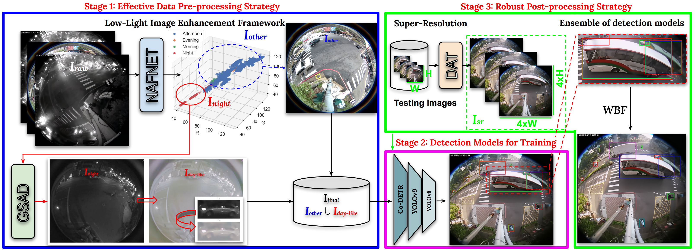
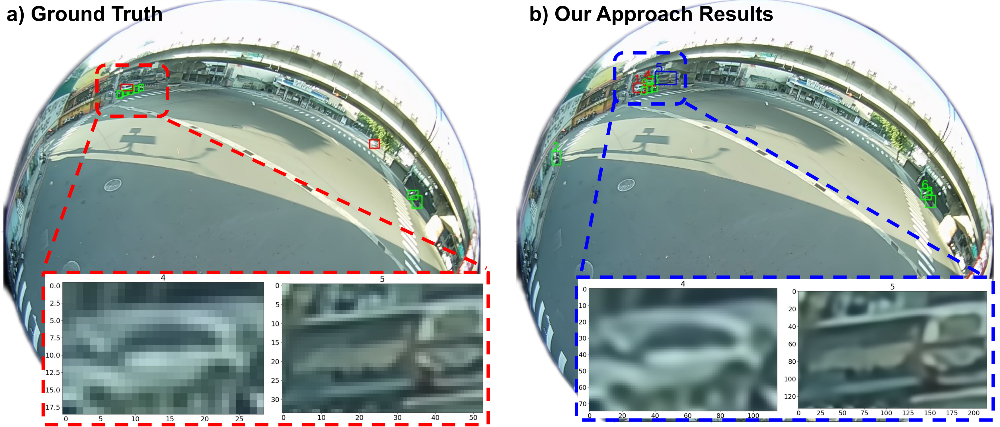

[CVPRW 2024] Low-Light Image Enhancement Framework for Improved Object Detection in Fisheye Lens Datasets
================================================================================================
## Introduction
This repo contains **Team 15 (SKKU-NDSU)** code for the **Track 4** submission  to the [CVPR AI City Challenge 2024](https://www.aicitychallenge.org/). 
We propose a data preprocessing framework called the **Low-Light Image Enhancement Framework**. This framework utilizes a transformer-based image enhancement technique, NAFNet, to increase image clarity by removing blurriness and the use of GSAD to convert nighttime images (low illumination) to daytime images (high illumination) to improve accuracy in object detection for fisheye images during model training. To further improve the accuracy of object detection during inference, the study employed a super-resolution postprocessing technique, DAT, to increase the pixels of the images for enhanced object detection, as well as an ensemble model technique for robust detection.
## Proposed Approach
Our methodology is visually encapsulated in the figures below, demonstrating our comprehensive approach and exemplary results.




## Updates
Our paper is posted on [arXiv](https://arxiv.org/abs/2404.10078)!

## Installation
Here is the list of libraries used in this project:
- [MMDetection](https://github.com/open-mmlab/mmdetection)
- [NAFNet](https://github.com/megvii-research/NAFNet)
- [GSAD](https://github.com/jinnh/GSAD)
- [DAT](https://github.com/zhengchen1999/DAT)
- [YOLOv8](https://github.com/ultralytics/ultralytics), [YOLOv9](https://github.com/WongKinYiu/yolov9)

Note: For optimal performance, we recommend setting up separate environments for each library. Exported conda environments are provided in the [conda_envs](./conda_envs) directory.
The proposed approach is inference on Intel Core i9, and NVIDIA 4090 24GB and 64GB RAM. Models are trained on Intel Xeon Silver 4210R, and 2 NVIDIA RTX A6000 48GB and 126GB RAM
## Preprocessing
### Download the FishEye8K Dataset
Download the FishEye8K dataset from the [AI City Challenge](https://github.com/MoyoG/FishEye8K), add to the folder [./sample_dataset](./sample_dataset).
Unzip **Fisheye8K_all_including_train&test_update_2024Jan.zip**
```
7z x Fisheye8K_all_including_train\&test_update_2024Jan.zip
```
Download CVPR test set (1000 images) from the [AI City Challenge](https://www.aicitychallenge.org/2024-ai-city-challenge/), add to the folder [./sample_dataset/CVPR_test](./sample_dataset/CVPR_test).

Receive the following directory structure:
```
./sample_dataset/CVPR_test
./sample_dataset/Fisheye8K_all_including_train&test
|
|---train
|   |---annotations
|   |---images
|   |---labels
|   |---train.json
|___test
|   |---annotations
|   |---images
|   |---labels
|   |---test.json
```
### Generate JSON Annotation Files
Modify the following paths in [generate_org_json.py](./src/preprocessing/generate_org_json.py) to generate the JSON annotation files:
```
DIR = '{ABSOLUTE_DIR}/AIC2024-TRACK4-TEAM15/sample_dataset/Fisheye8K_all_including_train&test'
TRAIN_ANNOTATION_PATH = '{ABSOLUTE_DIR}/AIC2024-TRACK4-TEAM15/sample_dataset/Fisheye8K_all_including_train&test/train/annotations'
VAL_ANNOTATION_PATH = '{ABSOLUTE_DIR}/AIC2024-TRACK4-TEAM15/sample_dataset/Fisheye8K_all_including_train&test/test/annotations'
```
_Note: we used absolute paths in the code. Please modify the paths accordingly._
```
python src/preprocessing/generate_org_json.py
```
Receive the following files:
```
train_raw_fisheye8k.json
val_raw_fisheye8k.json
```
### Image Enhancement using NAFNet
We directly use the pre-trained model **NAFNet-REDS-width64** from the [NAFNet](https://github.com/megvii-research/NAFNet) official Github repo.

Download the pre-trained model from [NAFNet-REDS-width64.pth](https://drive.google.com/file/d/14D4V4raNYIOhETfcuuLI3bGLB-OYIv6X/view) and add to the folder [./src/lib/infer_NAFNet/experiments/pretrained_models/](./src/lib/infer_NAFNet/experiments/pretrained_models/).

Modify the following paths in [NAFNet-width64.yml](./src/lib/infer_NAFNet/options/test/REDS/NAFNet-width64.yml) to add weight for NAFNet.
```
{ABSOLUTE_DIR}/AIC2024-TRACK4-TEAM15/src/lib/infer_NAFNet/experiments/pretrained_models/NAFNet-REDS-width64.pth
```
Modify the following paths in [nafnet_inference.py](./src/lib/infer_NAFNet/nafnet_inference.py) to generate the enhanced images:

```
opt_path =  '{ABSOLUTE_DIR}/AIC2024-TRACK4-TEAM15/src/lib/infer_NAFNet/options/test/REDS/NAFNet-width64.yml'

TRAIN_DIR = "{ABSOLUTE_DIR}/AIC2024-TRACK4-TEAM15/sample_dataset/Fisheye8K_all_including_train&test/train/images"
VAL_DIR = "{ABSOLUTE_DIR}/AIC2024-TRACK4-TEAM15/sample_dataset/Fisheye8K_all_including_train&test/test/images"
TEST_DIR = "{ABSOLUTE_DIR}/AIC2024-TRACK4-TEAM15/sample_dataset/CVPR_test"

TRAIN_SAVE_DIR = "{ABSOLUTE_DIR}/AIC2024-TRACK4-TEAM15/sample_dataset/NAFNet_Output/train"
VAL_SAVE_DIR = "{ABSOLUTE_DIR}/AIC2024-TRACK4-TEAM15/sample_dataset/NAFNet_Output/val"
TEST_SAVE_DIR = "{ABSOLUTE_DIR}/AIC2024-TRACK4-TEAM15/sample_dataset/NAFNet_Output/cvpr_test"
```
```
python src/lib/infer_NAFNet/nafnet_inference.py
```

### Convert to day-light images using GSAD
Pre-trained model [GSAD](https://github.com/jinnh/GSAD) is used to convert the night images to day-like images. Pre-trained model on LOLv2Syn dataset is used.

Download the pre-trained model from [lolv2_syn_gen.pth](https://drive.google.com/drive/folders/1KLPm2oOg2Fx4WlbnOXMjN2rbyzzG8Hd-), and add to [./src/lib/infer_GSAD/checkpoints](./src/lib/infer_GSAD/checkpoints)

```
cd ./src/lib/infer_GSAD

# Converting night time train images
python test_unpaired.py --input {ABSOLUTE_DIR}/AIC2024-TRACK4-TEAM15/sample_dataset/NAFNet_Output/train/ --save_dir {ABSOLUTE_DIR}/AIC2024-TRACK4-TEAM15/sample_dataset/GSAD_Output/train
# Converting night time val images
python test_unpaired.py --input {ABSOLUTE_DIR}/AIC2024-TRACK4-TEAM15/sample_dataset/NAFNet_Output/val/ --save_dir{ABSOLUTE_DIR}/AIC2024-TRACK4-TEAM15/sample_dataset/GSAD_Output/val
```
Converted images will be saved in the following directories:
```
./sample_dataset/GSAD_Output/train
./sample_dataset/GSAD_Output/val
```
### Generate the final json  for training
Modify the paths in [generate_final_json.py](./src/preprocessing/generate_final_json.py) to generate the final JSON annotation files:
```
cd src/preprocessing
python generate_final_json.py
```

## Training YOLOv9
Copy train, validation images and labels (.txt file from original FishEye8K) to the following directories:
```
"{ABSOLUTE_DIR}/AIC2024-TRACK4-TEAM15/src/preprocessing/images"
"{ABSOLUTE_DIR}/AIC2024-TRACK4-TEAM15/src/preprocessing/labels"
```
Note: val and test folder using validation images.

Run [yolov9_convert2txt.ipynb](./src/preprocessing/yolov9_convert2txt.ipynb) to export train_all.txt, train_txt_org.txt, test_txt_org.txt files.

Modify [nafnet_trainorg](./src/lib/train_yolov9/data/nafnet_trainorg.yaml) yaml for training.
```
train: '{ABSOLUTE_DIR}/AIC2024-TRACK4-TEAM15/src/preprocessing/train_txt_org.txt'
val: '{ABSOLUTE_DIR}/AIC2024-TRACK4-TEAM15/src/preprocessing/val_txt_org.txt'
test: '{ABSOLUTE_DIR}/AIC2024-TRACK4-TEAM15/src/preprocessing/test_txt_org.txt'
```

Download and install yolov9 from [YOLOv9](https://github.com/WongKinYiu/yolov9), train yolov9e on the FishEye8K dataset.
```
python -m torch.distributed.launch --nproc_per_node 2 --master_port 9092 train_dual.py --workers 16 --device 0,1 --sync-bn --batch 4 --data data/nafnet_trainorg.yaml --img 1280 --cfg models/detect/yolov9-e.yaml --weights 'yolov9-e.pt' --name nafnet_yolov9e_1280_trainorg --hyp hyp.scratch-high.yaml --min-items 0 --epochs 500 --close-mosaic 15
```
For training raw images, copy images directly from FishEye8K dataset. For training enhanced images, copy images from the NAFNet_Output directory.

## Training YOLOv8

Similarly, clone and install yolov8. Modify [nafnet_all_default.yaml](./src/lib/train_yolov8/nafnet_all_default.yaml)
```
train: '{ABSOLUTE_DIR}/AIC2024-TRACK4-TEAM15/src/preprocessing/train2017/images'
val: '{ABSOLUTE_DIR}/AIC2024-TRACK4-TEAM15/src/preprocessing/val2017/images'

nc: 5

# Classes
names: ['Bus','Bike','Car','Pedestrian','Truck']
```

Train model with the following command:
```
yolo task=detect mode=train model=yolov8x.pt imgsz=1280 data=nafnet_all_default.yaml epochs=400 batch=8 name=jan_nafnet_yolov8x_default_1280 --device=0,1
```


## Training Co-DETR

Here we show how to train the CO-DETR model on the FishEye8K dataset.

Modify **ann_file** for train and val in [./src/lib/train_mmdet/projects/CO-DETR/configs/codino/r50_lsj.py](./src/lib/train_mmdet/projects/CO-DETR/configs/codino/r50_lsj.py)
```
ann_file='{ABSOLUTE_DIR}/AIC2024-TRACK4-TEAM15/src/preprocessing/nafnet_val_night2day.json'
```
Co-DETR model is trained on 2 GPUs. 
```
cd src/lib/train_mmdet
sh tools/dist_train.sh projects/CO-DETR/configs/codino/swinL_detr_o365_coco.py 2
```

Using [./src/preprocessing/split_kfolds.ipynb](./src/preprocessing/split_kfolds.ipynb) for generating k-folds for training and validation. 

Similarly, modify **ann_file** in [./src/lib/train_mmdet/projects/CO-DETR/configs/codino/r50_lsj.py](./src/lib/train_mmdet/projects/CO-DETR/configs/codino/r50_lsj.py) for training and validation.

## Super Resolution

We use the [DAT](https://github.com/zhengchen1999/DAT) algorithm to perform super-resolution on the testing images. Each test image is scaled by a factor of 4.

Download the pre-trained model from [DAT_x4.pth](https://drive.google.com/drive/folders/14VG5mw5ie8RrR4jjypeHynXDZYWL8w-r) and add to [./src/lib/infer_DAT/experiments/pretrained_models](./src/lib/infer_DAT/experiments/pretrained_models)

Modify **dataroot_lq** and **pretrain_network_g** in [./src/lib/infer_DAT/options/Test/convert_CVPR_test.yaml](./src/lib/infer_DAT/options/Test/convert_CVPR_test.yaml)

```

cd src/lib/infer_DAT

python basicsr/test.py -opt options/Test/convert_CVPR_test.yaml
```
Output of CVPR test images will be saved in the following directory:
```
{ABSOLUTE_DIR}/AIC2024-TRACK4-TEAM15/src/lib/infer_DAT/results/test_single_x4/visualization/SingleCVPR_test.yaml
```
## Inference for submission on CVPR test set

Download all pre-trained models in [here](https://drive.google.com/drive/folders/1U49BYynu8A6hU_RJy1TlsyxfOM8A2zfq?usp=drive_link) and put them in the following directories:
```
./src/pretrained_weights
```
Modify the following paths in [inference4submission.py](./src/inference4submission.py) to generate the final submission file:
```
TEST_DIR = '{ABSOLUTE_DIR}/AIC2024-TRACK4-TEAM15/src/lib/infer_DAT/results/test_single_x4/visualization'
ORG_CVPR_DIR = '{ABSOLUTE_DIR}/AIC2024-TRACK4-TEAM15/sample_dataset/CVPR_test'
```
```
python src/inference4submission.py
```

## Contact

If you have any questions, please feel free to contact Dai Tran [(daitran@skku.edu)](daitran@skku.edu).


